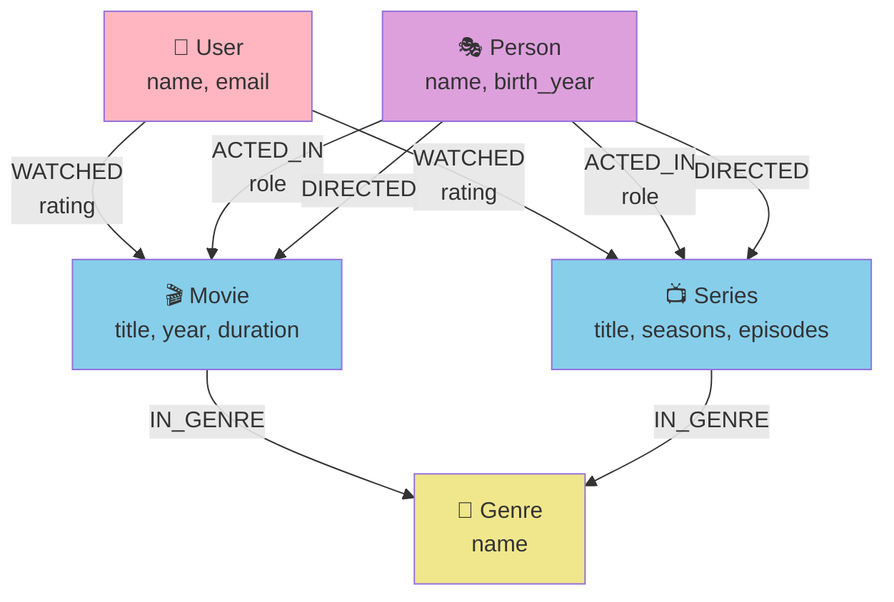

<div align="center">

# 🎬 Grafo de Conhecimento de Filmes e Séries

### *Modelagem de dados com Neo4j para simulação de plataforma de streaming*


---

## 📑 Índice

<table align="center">
<tr>
<td>

- [📚 Sobre o Projeto](#-sobre-o-projeto)
- [🎯 Objetivos](#-objetivos)
- [🛠️ Tecnologias](#️-tecnologias)
- [📁 Estrutura](#-estrutura)
- [🚀 Começando](#-começando)

</td>
<td>

- [📊 Modelo de Dados](#-modelo-de-dados)
- [💡 Consultas](#-consultas)
- [🏆 Resultados](#-resultados)
- [📝 Licença](#-licença)
- [👩‍💻 Autora](#-autora)

</td>
</tr>
</table>

---

## 📚 Sobre o Projeto

```
┌─────────────────────────────────────────────────────────────┐
│  Este projeto foi desenvolvido como desafio do              │
│  Bootcamp Neo4j e Análise de Dados com Grafos pela DIO     │
└─────────────────────────────────────────────────────────────┘
```

Criação de um **Grafo de Conhecimento** que simula um serviço de streaming, modelando as relações entre:

| 👥 Usuários | 🎬 Filmes | 📺 Séries | 🎭 Atores | 🎬 Diretores | 🎪 Gêneros |
|:-----------:|:---------:|:---------:|:---------:|:------------:|:----------:|
| Assistem | Contêm | Contêm | Atuam | Dirigem | Classificam |

---

## 🎯 Objetivos

### 📌 Requisitos do Desafio

<table align="center">
<tr>
<td width="50%">

#### 1️⃣ **Entidades (Nós)**

Mínimo de **10 nós** por tipo:

```cypher
// Labels principais
- User      // Usuários
- Movie     // Filmes
- Series    // Séries
- Person    // Atores/Diretores
- Genre     // Gêneros
```

</td>
<td width="50%">

#### 2️⃣ **Relacionamentos**

Conexões entre entidades:

```cypher
// Relações do modelo
- WATCHED    {rating: Float}
- ACTED_IN
- DIRECTED
- IN_GENRE
```

</td>
</tr>
</table>

### 🎨 Estrutura do Modelo



---

## 🛠️ Tecnologias

<table align="center">
<tr>
<td align="center" width="25%">

<br><b>Neo4j</b>
<br><sub>Database</sub>
</td>
<td align="center" width="25%">

<br><b>Git</b>
<br><sub>Version Control</sub>
</td>
<td align="center" width="25%">

<br><b>CSV</b>
<br><sub>Data Format</sub>
</td>
</tr>
</table>

---

## 📁 Estrutura

```
📦 neo4j-movie-knowledge-graph
│
├── 📂 data/                    # Arquivos de dados
│   ├── 📄 users.csv           # Usuários do sistema
│   ├── 📄 movies.csv          # Catálogo de filmes
│   ├── 📄 series.csv          # Catálogo de séries
│   ├── 📄 genres.csv          # Gêneros disponíveis
│   ├── 📄 people.csv          # Atores e diretores
│   └── 📄 relationships.csv   # Relações entre entidades
│
├── 📂 scripts/                 # Scripts Cypher
│   ├── 🔧 01_create_constraints.cypher
│   ├── 📥 02_import_data.cypher
│   └── 🔍 03_queries.cypher
│
├── 📂 docs/                    # Documentação
│   ├── 🖼️ modelo_grafo.png
│   └── 📖 exemplos_queries.md
│
├── 📄 README.md
└── 📄 LICENSE
```

---

## 🚀 Começando

### ✅ Pré-requisitos

<table align="center">
<tr>
<td>

- 🖥️ [Neo4j Desktop](https://neo4j.com/download/) ou [Neo4j Aura](https://neo4j.com/cloud/aura/)
- 💻 Cypher Shell ou Neo4j Browser
- 📦 Git instalado

</td>
</tr>
</table>

### 📋 Instalação

<details>
<summary><b>🔽 Passo 1: Clonar o Repositório</b></summary>

```bash
git clone git@github.com:nataliaberbetviana/neo4j-movie-knowledge-graph.git
cd neo4j-movie-knowledge-graph
```

</details>

<details>
<summary><b>🔽 Passo 2: Configurar Neo4j</b></summary>

1. Abra o **Neo4j Desktop**
2. Crie um novo banco de dados
3. Inicie o banco de dados
4. Abra o **Neo4j Browser**

</details>

<details>
<summary><b>🔽 Passo 3: Executar Scripts</b></summary>

Execute os scripts na ordem:

[//]: # (```cypher)

[//]: # (// 1️⃣ Criar restrições e índices)

[//]: # (:source scripts/01_create_constraints.cypher)

[//]: # ()
[//]: # (// 2️⃣ Importar dados dos CSVs)

[//]: # (:source scripts/02_import_data.cypher)

[//]: # ()
[//]: # (// 3️⃣ Executar queries de exemplo)

[//]: # (:source scripts/03_queries.cypher)

[//]: # (```)

</details>

---

## 📊 Modelo de Dados

### 🏗️ Arquitetura do Grafo

| Entidade | Propriedades | Descrição |
|:--------:|:-------------|:----------|
| **👤 User** | `name`, `email`, `created_at` | Usuários da plataforma |
| **🎬 Movie** | `title`, `year`, `duration`, `description` | Filmes disponíveis |
| **📺 Series** | `title`, `seasons`, `episodes`, `description` | Séries disponíveis |
| **🎭 Person** | `name`, `birth_year`, `nationality` | Atores e diretores |
| **🎪 Genre** | `name`, `description` | Gêneros cinematográficos |

### 🔗 Relacionamentos

```cypher
// Padrões de relacionamento
(:User)-[:WATCHED {rating: 4.5, watched_at: datetime()}]->(:Movie)
(:Person)-[:ACTED_IN {role: "Personagem"}]->(:Movie)
(:Person)-[:DIRECTED {year: 2020}]->(:Movie)
(:Movie)-[:IN_GENRE]->(:Genre)
```

---

## 💡 Consultas

### 🔍 Exemplos de Queries

<details>
<summary><b>📊 Top 10 Filmes Mais Assistidos</b></summary>

[//]: # (```cypher)

[//]: # (MATCH &#40;u:User&#41;-[w:WATCHED]->&#40;m:Movie&#41;)

[//]: # (RETURN m.title AS Filme, )

[//]: # (       count&#40;w&#41; AS TotalVisualizações,)

[//]: # (       avg&#40;w.rating&#41; AS AvaliaçãoMédia,)

[//]: # (       max&#40;w.rating&#41; AS MelhorNota)

[//]: # (ORDER BY TotalVisualizações DESC, AvaliaçãoMédia DESC)

[//]: # (LIMIT 10;)

[//]: # (```)

</details>

<details>
<summary><b>🎭 Atores Frequentes de um Diretor</b></summary>

[//]: # (```cypher)

[//]: # (MATCH &#40;d:Person&#41;-[:DIRECTED]->&#40;m:Movie&#41;<-[:ACTED_IN]-&#40;a:Person&#41;)

[//]: # (WHERE d.name = "Christopher Nolan")

[//]: # (WITH a, count&#40;m&#41; AS colaborações)

[//]: # (WHERE colaborações > 1)

[//]: # (RETURN a.name AS Ator, colaborações)

[//]: # (ORDER BY colaborações DESC;)

[//]: # (```)

</details>

<details>
<summary><b>🎯 Sistema de Recomendação</b></summary>

[//]: # (```cypher)

[//]: # (// Baseado em gêneros favoritos do usuário)

[//]: # (MATCH &#40;u:User {name: "Maria"}&#41;-[:WATCHED]->&#40;m:Movie&#41;-[:IN_GENRE]->&#40;g:Genre&#41;)

[//]: # (WITH u, g, count&#40;*&#41; AS preferência)

[//]: # (ORDER BY preferência DESC)

[//]: # (LIMIT 3)

[//]: # ()
[//]: # (MATCH &#40;g&#41;<-[:IN_GENRE]-&#40;recomendação:Movie&#41;)

[//]: # (WHERE NOT EXISTS&#40;&#40;u&#41;-[:WATCHED]->&#40;recomendação&#41;&#41;)

[//]: # ()
[//]: # (RETURN DISTINCT recomendação.title AS Recomendação,)

[//]: # (       g.name AS Gênero,)

[//]: # (       preferência AS ScoreGênero)

[//]: # (ORDER BY preferência DESC)

[//]: # (LIMIT 5;)

[//]: # (```)

</details>

<details>
<summary><b>🌟 Atores Mais Populares</b></summary>

[//]: # (```cypher)

[//]: # (MATCH &#40;p:Person&#41;-[:ACTED_IN]->&#40;m:Movie&#41;<-[w:WATCHED]-&#40;u:User&#41;)

[//]: # (RETURN p.name AS Ator,)

[//]: # (       count&#40;DISTINCT m&#41; AS Filmes,)

[//]: # (       count&#40;w&#41; AS Visualizações,)

[//]: # (       avg&#40;w.rating&#41; AS AvaliaçãoMédia)

[//]: # (ORDER BY Visualizações DESC)

[//]: # (LIMIT 10;)

[//]: # (```)

</details>

---

## 🏆 Resultados

### 📈 Estatísticas do Projeto

| Métrica | Valor |
|:--------|------:|
| 📊 **Total de Nós** | 50+ |
| 🔗 **Total de Relacionamentos** | 100+ |
| 👥 **Usuários Cadastrados** | 10+ |
| 🎬 **Filmes no Catálogo** | 15+ |
| 📺 **Séries Disponíveis** | 15+ |
| 🎭 **Pessoas (Atores/Diretores)** | 20+ |
| 🎪 **Gêneros** | 10+ |

### ✨ Funcionalidades Implementadas

- ✅ Sistema de avaliações (ratings) de 0 a 5
- ✅ Recomendações baseadas em preferências
- ✅ Análise de padrões de visualização
- ✅ Identificação de colaborações frequentes
- ✅ Rankings de popularidade
- ✅ Queries otimizadas com índices

---

## 📝 Licença

Este projeto está licenciado sob a **MIT License**.

Veja o arquivo [LICENSE](LICENSE) para mais detalhes.

[](LICENSE)

---

## 👩‍💻 Autora


### **Natália Berbet Viana**

*Desenvolvido com 💙 e muito ☕*

<br>

[](https://linkedin.com/in/nataliaberbetviana)
[](https://github.com/nataliaberbetviana)
[](https://nataliaberbetviana.github.io/)

---

### ⭐ Se este projeto foi útil, considere dar uma estrela!

<br>

**Feito com Neo4j, Cypher e muita dedicação 🚀**

<br>

```
╔══════════════════════════════════════════════════════════╗
║  "Dados são apenas dados. Grafos contam histórias." 📊  ║
╚══════════════════════════════════════════════════════════╝
```

---

<sub>Projeto desenvolvido para o Bootcamp Neo4j & Análise de Dados com Grafos | DIO © 2025</sub>

</div>