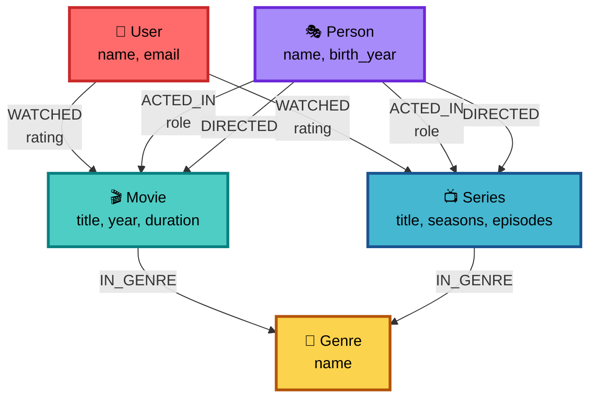

<div align="center">

# 🎬 Grafo de Conhecimento de Filmes e Séries

### *Modelagem de dados com Neo4j para simulação de plataforma de streaming*


</div>

---
<details>
<summary><h2> 📑 Índice </h2></summary>


<a href="#sobre-o-projeto"> 📚  Sobre o Projeto</a><br>
<a href="#objetivos"> 🎯  Objetivos</a><br>
<a href="#tecnologias"> 🛠️  Tecnologias</a><br>
<a href="#estrutura"> 📁  Estrutura</a><br>
<a href="#comecando"> 🚀  Começando</a><br>
<a href="#modelo-de-dados">📊  Modelo de Dados</a><br>
<a href="#consultas"> 💡  Consultas</a><br>
<a href="#resultados"> 🏆  Resultados</a><br>
<a href="#licenca"> 📄  Licença</a><br>
<a href="#Autora"> 👩‍💻  Autora</a><br>
</details>

---
<a id="sobre-o-projeto"></a>
## 📚 Sobre o Projeto

<div align="center">

Este projeto foi desenvolvido como desafio do **Bootcamp Neo4j e Análise de Dados com Grafos** pela **DIO**.

Criação de um **Grafo de Conhecimento** que simula um serviço de streaming, modelando as relações entre:

| 👥 Usuários | 🎬 Filmes | 📺 Séries | 🎭 Atores | 🎬 Diretores | 🎪 Gêneros |
|:-----------:|:---------:|:---------:|:---------:|:------------:|:----------:|
| Assistem | Contêm | Contêm | Atuam | Dirigem | Classificam |

</div>

---
<a id="objetivos"></a>
## 🎯 Objetivos

### 📌 Requisitos do Desafio

#### 1️⃣ **Entidades (Nós)**

Mínimo de **10 nós** por tipo:

```cypher
// Labels principais
- User      // Usuários
- Movie     // Filmes
- Series    // Séries
- Person    // Atores/Diretores
- Genre     // Gêneros
```

#### 2️⃣ **Relacionamentos**

Conexões entre entidades:

```cypher
// Relações do modelo
- WATCHED    {rating: Float}
- ACTED_IN   {role: String}
- DIRECTED   {year: Integer}
- IN_GENRE
```

### 🎨 Estrutura do Modelo



---
<a id="tecnologias"></a>
## 🛠️ Tecnologias

<div align="center">

| Tecnologia | Descrição |
|:----------:|:----------|
| <br>**Neo4j** | Banco de dados de grafos |
| <br>**Git** | Controle de versão |
| 📊 **CSV** | Formato de dados |

</div>

---
<a id="estrutura"></a>
## 📁 Estrutura

```
📦 neo4j-movie-knowledge-graph
│
├── 📂 data/
│   ├── 📄 users.csv
│   ├── 📄 movies.csv
│   ├── 📄 series.csv
│   ├── 📄 genres.csv
│   ├── 📄 people.csv
│   └── 📄 relationships.csv
│
├── 📂 scripts/
│   ├── 📧 01_create_constraints.cypher
│   ├── 📥 02_import_data.cypher
│   └── 📝 03_queries.cypher
│
├── 📂 docs/
│   ├── 🖼️ modelo_grafo.png
│   └── 📖 exemplos_queries.md
│
├── 📄 README.md
└── 📄 LICENSE
```

---
<a id="comecando"></a>
## 🚀 Começando

### ✅ Pré-requisitos

- 🖥️ [Neo4j Desktop](https://neo4j.com/download/) ou [Neo4j Aura](https://neo4j.com/cloud/aura/)
- 💻 Cypher Shell ou Neo4j Browser
- 📦 Git instalado

### 📋 Instalação

<details>
<summary><b>📥 Passo 1: Clonar o Repositório</b></summary>

```bash
git clone git@github.com:nataliaberbetviana/neo4j-movie-knowledge-graph.git
cd neo4j-movie-knowledge-graph
```

</details>

<details>
<summary><b>⚙️ Passo 2: Configurar Neo4j</b></summary>

1. Abra o **Neo4j Desktop**
2. Crie um novo banco de dados
3. Inicie o banco de dados
4. Abra o **Neo4j Browser**

</details>

<details>
<summary><b>▶️ Passo 3: Executar Scripts</b></summary>

Execute os scripts na ordem:

```cypher
// 1️⃣ Criar restrições e índices
:source scripts/01_create_constraints.cypher

// 2️⃣ Importar dados dos CSVs
:source scripts/02_import_data.cypher

// 3️⃣ Executar queries de exemplo
:source scripts/03_queries.cypher
```

</details>

---
<a id="modelo-de-dados"></a>
## 📊 Modelo de Dados

### 🗝️ Arquitetura do Grafo

| Entidade | Propriedades | Descrição |
|:--------:|:-------------|:----------|
| **👤 User** | `name`, `email`, `created_at` | Usuários da plataforma |
| **🎬 Movie** | `title`, `year`, `duration`, `description` | Filmes disponíveis |
| **📺 Series** | `title`, `seasons`, `episodes`, `description` | Séries disponíveis |
| **🎭 Person** | `name`, `birth_year`, `nationality` | Atores e diretores |
| **🎪 Genre** | `name`, `description` | Gêneros cinematográficos |

### 🔗 Relacionamentos

```cypher
// Padrões de relacionamento
(:User)-[:WATCHED {rating: 4.5, watched_at: datetime()}]->(:Movie)
(:Person)-[:ACTED_IN {role: "Personagem"}]->(:Movie)
(:Person)-[:DIRECTED {year: 2020}]->(:Movie)
(:Movie)-[:IN_GENRE]->(:Genre)
```

---
<a id="consultas"></a>
## 💡 Consultas

### 🔍 Exemplos de Queries

<details>
<summary><b>📊 Top 10 Filmes Mais Assistidos</b></summary>

```cypher
MATCH (u:User)-[w:WATCHED]->(m:Movie)
RETURN m.title AS Filme, 
       count(w) AS TotalVisualizações,
       avg(w.rating) AS AvaliaçãoMédia,
       max(w.rating) AS MelhorNota
ORDER BY TotalVisualizações DESC, AvaliaçãoMédia DESC
LIMIT 10;
```

</details>

<details>
<summary><b>🎭 Atores Frequentes de um Diretor</b></summary>

```cypher
MATCH (d:Person)-[:DIRECTED]->(m:Movie)<-[:ACTED_IN]-(a:Person)
WHERE d.name = "Christopher Nolan"
WITH a, count(m) AS colaborações
WHERE colaborações > 1
RETURN a.name AS Ator, colaborações
ORDER BY colaborações DESC;
```

</details>

<details>
<summary><b>🎯 Sistema de Recomendação</b></summary>

```cypher
// Baseado em gêneros favoritos do usuário
MATCH (u:User {name: "Maria"})-[:WATCHED]->(m:Movie)-[:IN_GENRE]->(g:Genre)
WITH u, g, count(*) AS preferência
ORDER BY preferência DESC
LIMIT 3

MATCH (g)<-[:IN_GENRE]-(recomendação:Movie)
WHERE NOT EXISTS((u)-[:WATCHED]->(recomendação))

RETURN DISTINCT recomendação.title AS Recomendação,
       g.name AS Gênero,
       preferência AS ScoreGênero
ORDER BY preferência DESC
LIMIT 5;
```

</details>

<details>
<summary><b>🌟 Atores Mais Populares</b></summary>

```cypher
MATCH (p:Person)-[:ACTED_IN]->(m:Movie)<-[w:WATCHED]-(u:User)
RETURN p.name AS Ator,
       count(DISTINCT m) AS Filmes,
       count(w) AS Visualizações,
       avg(w.rating) AS AvaliaçãoMédia
ORDER BY Visualizações DESC
LIMIT 10;
```

</details>

---
<a id="resultados"></a>
## 🏆 Resultados

### 📈 Estatísticas do Projeto

| Métrica | Valor |
|:--------|------:|
| 📊 **Total de Nós** | 50+ |
| 🔗 **Total de Relacionamentos** | 100+ |
| 👥 **Usuários Cadastrados** | 10+ |
| 🎬 **Filmes no Catálogo** | 15+ |
| 📺 **Séries Disponíveis** | 15+ |
| 🎭 **Pessoas (Atores/Diretores)** | 20+ |
| 🎪 **Gêneros** | 10+ |

### ✨ Funcionalidades Implementadas

- ✅ Sistema de avaliações (ratings) de 0 a 5
- ✅ Recomendações baseadas em preferências
- ✅ Análise de padrões de visualização
- ✅ Identificação de colaborações frequentes
- ✅ Rankings de popularidade
- ✅ Queries otimizadas com índices

---
<a id="licenca"></a>
## 📄 Licença

Este projeto está licenciado sob a **MIT License**.

Veja o arquivo [LICENSE](LICENSE) para mais detalhes.

[](LICENSE)

---
<a id="autora"></a>
## 👩‍💻 Autora

<div align="center">


### **Natália Berbet Viana**

*Desenvolvido com 💙 e muito ☕*

[](https://linkedin.com/in/nataliaberbetviana)
[](https://github.com/nataliaberbetviana)
[](https://nataliaberbetviana.github.io/)

---

### ⭐ Se este projeto foi útil, considere dar uma estrela!

**Feito com Neo4j, Cypher e muita dedicação 🚀**

<br>

```
    ╔═══════════════════════════════════════════════════════════╗
    ║   "Dados são apenas dados. Grafos contam histórias." 📊   ║
    ╚═══════════════════════════════════════════════════════════╝
```

<sub>Projeto desenvolvido para o Bootcamp Neo4j & Análise de Dados com Grafos | DIO © 2025</sub>

</div>
